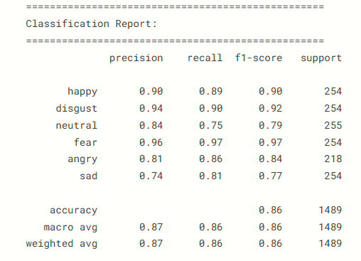

#  Multimodal Emotion Recognition (Audio + Video)

## 📌 Overview
Ce projet implémente un système de **reconnaissance des émotions multimodale** en combinant :

- 🎥 **Vidéo** (expressions faciales)
- 🔊 **Audio** (caractéristiques vocales)

L'objectif est d'améliorer la précision en fusionnant plusieurs sources d'information.

---

##  Architecture du modèle

Le modèle est basé sur une architecture deep learning multimodale :

- 📷 **Backbone Vidéo** : EfficientNet-B0 
- 🔊 **Backbone Audio** : ResNet18 
- 🔗 **Fusion** : concaténation des features audio + vidéo
- 🔁 **Temporal Modeling** : LSTM
- 🎯 **Classification** : réseau fully connected

---

##  Dataset

Le projet utilise le dataset :

- CREMA-D (vidéo + audio)

Les données sont traitées pour créer des paires :
- `video_path`
- `audio_path`
- `emotion`

### 🎭 Émotions détectées :
- Angry 😠  
- Disgust 🤢  
- Fear 😨  
- Happy 😄  
- Neutral 😐  
- Sad 😢  

---

##  Résultats

###  Matrice de confusion

