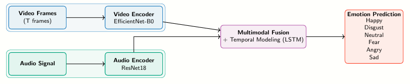

# Multimodal Emotion Detection

Reconnaissance d'émotions multimodale (audio + vidéo) sur le dataset **CREMA-D**, avec un modèle basé sur **EfficientNet-B0**, **ResNet18** et **LSTM**.


## Structure du projet


multimodal_emotion_detection/
│
├── src/
│   ├── __init__.py       # Exports du package
│   ├── data_loader.py    # Chargement des métadonnées audio/vidéo
│   ├── dataset.py        # Dataset PyTorch (frames vidéo + spectrogramme Mel)
│   ├── model.py          # Architecture MultimodalLSTM
│   ├── train.py          # Boucle d'entraînement + évaluation
│   └── eda.py            # Analyse exploratoire des données
│
├── outputs/              # 
├── requirements.txt
├── .gitignore
└── README.md
```

---

## Installation


pip install -r requirements.txt
```

---

## Dataset

Le projet utilise le dataset **CREMA-D** disponible sur Kaggle :

- Vidéos `.mp4` : [`alenken/multimodal-emotion-recognition-ravdess`](https://www.kaggle.com/datasets/alenken/multimodal-emotion-recognition-ravdess)
- Audio `.wav`  : [`ejlok1/cremad`](https://www.kaggle.com/datasets/ejlok1/cremad)

6 émotions : `angry`, `disgust`, `fear`, `happy`, `neutral`, `sad`

---

## Lancement de l'entraînement

Modifier les chemins dans `src/train.py` :

```python
VIDEO_ROOT = '/path/to/crema-d/videos'
AUDIO_ROOT = '/path/to/crema-d/AudioWAV'
```

Puis exécuter :

```bash
python -m src.train
```

---

## Architecture

```


---

## Résultats

Les courbes d'entraînement et la matrice de confusion sont sauvegardées dans `outputs/` après l'entraînement.

| Métrique         | Valeur (exemple) |
|------------------|-----------------|
| Meilleure val acc |86%              |
| Paramètres totaux | ~12M            |

---

## Utilisation programmatique

```python
from src.data_loader import load_multimodal_dataframe
from src.dataset import CremaDataset
from src.model import MultimodalLSTM

df = load_multimodal_dataframe(video_root="...", audio_root="...")
dataset = CremaDataset(df, seq_len=8)
model = MultimodalLSTM(num_classes=6)
```
